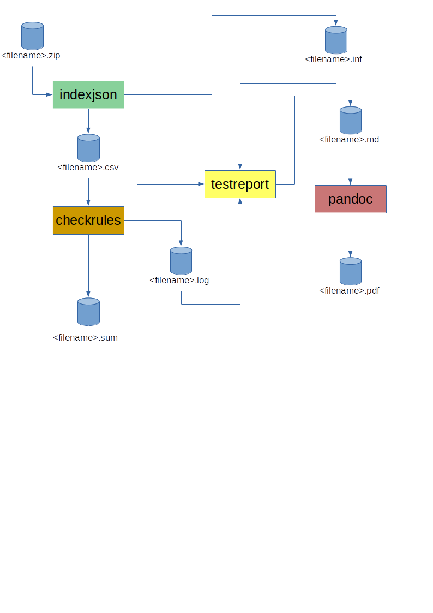

# Bitemp - a test of bitemporarity based on downloaded files

Bitemp is based on the rules for bitemporarity as stated in the Grunddata program. It is a set of tools to test that the based rules are followed.

## Overview

The script will extract and analyze (test) the file download for one file.
It is also possible to create a sqlite3 database based on the extracted data.

### Directory structure

The input is the compressed file (zip format) and the system will create one sub directory with the same base name as the input zip file.
In the sub directory the following files will be created:

1. filename.csv - the extracted data. Only line per object instance.
1. filename.inf - the key information from the file download (the number of object instances.)
1. filename.md - The test report in Markdown format
1. filename.pdf - the test report in PDF format
1. filename.sum - summary of the tests.
1. filename.log - details for the tests.

## Flow and scripts

The following is the flow of data and scripts for


## Installation

Run ./install.sh script and the scripts will be copied to the ~/bin directory

```bash
cp indexjson.pl ~/bin/
cp testreport.pl ~/bin/
cp checkrules.pl ~/bin/
cp createdb.sh ~/bin/
cp md2pdf.sh ~/bin/
cp analyzeFD.sh ~/bin
cp checkbitemp.pl ~/bin
cp do.sh ~/bin

```

## Usage

To run all steps use the analyzeFD.sh script

```bash
analyzeFD.sh <zipfile>
```

The script will create a sub-directory with the same name as the zipfile

## Notation

Virknintstid and Registreringstid is a time interval.

virkningstid = [ virkningstidstart .. virkningstidend [
registreringstid = [ registreringstidstart .. registreringstidend [

## Bitemporarity rules

1. Every data entity must have registreringstid, virkningstid and status
1. Registreringstid and virkningstid must have a start time and a end time (for virkningstid one does not need to specify the virkningstidstart and -end)
1. The must be no time overlap for registreringstid. Let Reg1 and Reg2 be the registreringstid for object1 and object2, Then the rules is Reg1 = Reg2 or Reg1 Union Reg2 = Ø
1. The must be no time overlap for virkningstid. Let Virk1 and Virk2 be the virkningstid for object1 and object2, Then the rules is Virk1 = Virk2 or Virk1 Union Virk2 = Ø

## Run indexjson with extraction

Usage:
perl indexjson.pl --zipfile=<zipfile> [--csv=<csvfile>][--info=<infofile>]

```
$ perl ./indexjson.pl  --zipfile=DAR-Totaludtraek-Ugentlig-JSON_20200223000500.zip
```

The indexjson will generate the following files:

- filename.csv - extracted values from the zip data file
- filename.inf - a file with the main statistics on the number objects per list

The csv file contains the following columns:

1. UUID
1. STARTPOS
1. ENDPOS
1. ENDLINE
1. LISTNAME
1. REGTIMEFRA
1. REGTIMETIL
1. VIRKTIMEFRA
1. VIRKTIMETIL
1. STATUS

## Sort the csv according to uuid and listname

```
sort -T. -t, --key=5 --key=1 $CSVFILE > $SORTFILE
```

## Build the SQLITE database

```
createdb.sh $BASENAME.db $REGISTER $CSVFILE

```

## Run check query

```
perl checkrules.pl --csv=<csvfile> --info=<infofile> [--report=<reportfile>]  [--debug]
```

The checkrules.pl will generate the following files:

- filename.log - detail test log
- filename.sum - summary test log

## Generate the test report

The script testreport.pl will generate the report.vand

## Converting the test report from Markdown to pdf

This is done using pandoc.

```bash
pandoc --pdf-engine=wkhtmltopdf ${BASENAME}.md -o ${BASENAME}.pdf
```
